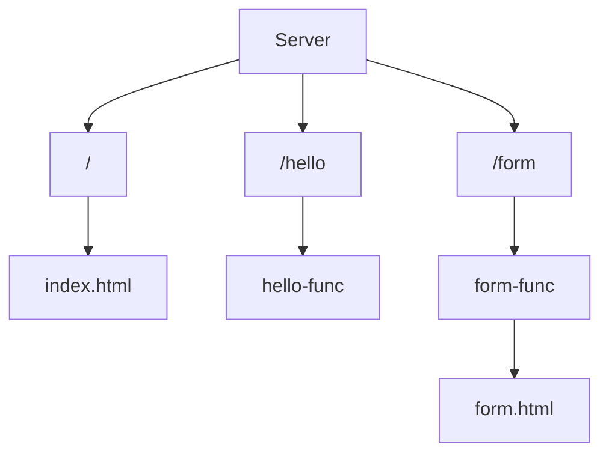

# Simple Web server 
This simple web server reads requests from user in form.html page and writes it in form page.

---

```mermaid
graph TD;
    Server-->/;
    Server-->/hello;
    Server-->/form;
    / --> index.html;
    /hello --> hello-func;
    /form --> form-func;
    form-func --> form.html;
```
